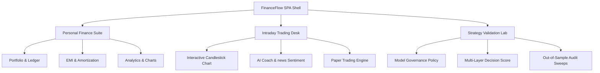

# 📊 FinanceFlow — Personal Finance Suite & Institutional Intraday Trading Workstation

[]()
[]()
[]()
[]()

FinanceFlow is a premium, institutional-grade personal finance ecosystem combined with an advanced **Intraday Trading Desk & AI Workstation**. Engineered with a glassmorphic modern UI and high-performance vanilla JavaScript modules, it merges standard portfolio and liability tracking with professional-grade algorithmic backtesting, calendar validations, and out-of-sample stress sweeps.

---

## 🌟 Core Architecture & Features



### 1. 💼 Personal Finance Suite & Liabilities Engine
* **Ledger & Persistence (`js/store.js`):** IIFE-isolated local storage engine managing transactions, budgets, savings goals, settings, and recurring payments. Exposes en-IN formatted currency and custom date strings.
* **Recurring Automation:** Automatic scheduler running on app startup that evaluates and logs pending recurring items (daily, weekly, monthly, yearly frequency) up to 100 historical cycles safely.
* **Canvas Charting Suite (`js/charts.js`):** High-DPI canvas charts with custom requestAnimationFrame ease-out entry animations. Supports bezier line charts with gradients, grouped bars, doughnuts, and interactive progress rings.
* **Loans & EMIs Engine (`js/emis.js`):** Dynamic liability workstation. Automatically tracks active loans, calculates EMIs using compound amortization formulas, and outputs a complete principal-interest schedule. Includes a debt-to-income warning progress bar (`<30%` healthy, `30-50%` moderate, `>50%` debt-trap danger).

### 2. 📈 Intraday Trading Desk & AI Workstation (`js/trading.js`)
* **Interactive Candlestick Chart:** OHLC rendering with custom volume profile overlays, supporting drag-to-pan and mouse-wheel zooming centered precisely on the user's cursor.
* **Indicator Overlays:** Toggleable Anchored VWAP, Opening Range Breakout (ORB) 15m channels, SMA (20), and Bollinger Bands overlays. Supports on-the-fly Heikin Ashi candle smoothing.
* **Cascading Price Feed (`js/stockdb.js`):** Real-time Yahoo Finance historical series fetched via cascading CORS proxies. Features an automatic, zero-failure synthetic price generator fallback if servers are offline or the market is closed.
* **Setup Probability Engine:** Renders long/short setup percentages derived from live news sentiment analysis, MACD crossovers, RSI extremes, and VWAP support/resistance touches.
* **Risk Management Console:** Automatically calculates Capital at Risk, Suggested Position Size (Shares), and Ideal Allocation using live balances from `FinanceStore`.
* **AI Coach Feedback Loop:** Dynamic behavioral dashboard tracking Win Rate, Profit Factor, Discipline Ratings (flagging Stop Loss breaches), Edge Analysis by setup type, and early exit metrics.

### 3. 🛡️ Strategy Validation Lab & Model Governance (`js/portfolioSimulator.js`)
* **Strict Quality-Over-Quantity Policy:** Enforces rigid sequential trade execution (**One Active Position Only**) with a maximum of 10 trades per day.
* **Session Cooldowns:** Mandatory **10-minute (2 bars in 5m timeframe) cooldown** following trade exits before scanners are allowed to re-evaluate entries.
* **Multi-Layer Decision Score:** Requires a composite confidence score of **$\ge 85$** (escalating to **$\ge 90$** if a trade has already completed in the session) across 8 discrete layers:
  * *Technical (0.22)*: Trend + Momentum + Volume alignment (No single-indicator entries).
  * *Market Context (0.20)*: Regime synergy validation.
  * *Order Flow (0.18)*: Volume surge (>1.5x) and momentum persistence.
  * *Historical Similarity (0.12)*: Requires $\ge 100$ matching historical setups; triggers `NO TRADE` skip if data is insufficient to prevent curve-fitting.
  * *News Sentiment (0.10)*, *Volume (0.08)*, *Sector Moves (0.05)*, and *Risk Quality (0.05)*.
* **Downside Circuit Breakers:**
  * **2 Consecutive Losses:** Pauses all scanning and trading for the active session.
  * **2% Daily Drawdown:** Triggers a **Hard Shutdown** state.
  * **Volatility Check:** Automatically cuts position size in half if ATR exceeds 2.5% of the asset's entry price.
* **National Calendar Validator:** Rejects backtests or day-replays attempted on weekends or NSE/BSE national stock market holidays, logging warning alerts.
* **Out-of-Sample Stress Sweeps:** Simulates performance across independent *Bearish Drift* and *High Volatility Range* sessions. Automatically certifies strategy as **ROBUSTNESS PASSED** or **ROBUSTNESS REJECTED** (warning against curve-fitted setups).

---

## 🛠️ Installation & Local Setup

### Prerequisites
* [Node.js](https://nodejs.org/) (v16.0.0 or higher recommended)

### 1. Clone & Navigate
```bash
git clone https://github.com/CodeWhizAfsal/am-chat.git
cd am-chat
```

### 2. Launch Local Servers
FinanceFlow runs as a single-page application. Launch a lightweight server to view it:
```bash
# Install and run local static server
npx -y http-server -p 8080 -c-1
```
The application will be accessible locally at `http://localhost:8080`.

### 3. Public Exposure (Localtunnel)
Expose the port publicly if testing responsive features on mobile or sharing with peers:
```bash
npx -y localtunnel --port 8080
```

---

## 📈 Codebase & Component Map

The core functionality is split modularly across the following files:

| Component | File Path | Responsibility |
| :--- | :--- | :--- |
| **Data Persistence** | [`js/store.js`](file:///C:/Users/majee/.gemini/antigravity/scratch/finance-manager/js/store.js) | LocalStorage management, summaries, and analytical totalizers. |
| **Chart Engines** | [`js/charts.js`](file:///C:/Users/majee/.gemini/antigravity/scratch/finance-manager/js/charts.js) | Canvas-based rendering, candlesticks, curves, and progress rings. |
| **Liabilities Suite** | [`js/emis.js`](file:///C:/Users/majee/.gemini/antigravity/scratch/finance-manager/js/emis.js) | EMI amortizations, liability alerts, and repayment pipelines. |
| **Workstation Engine** | [`js/trading.js`](file:///C:/Users/majee/.gemini/antigravity/scratch/finance-manager/js/trading.js) | Real-time paper execution, AI sentiment analysis, and coach metrics. |
| **Out-of-Sample Audit** | [`js/portfolioSimulator.js`](file:///C:/Users/majee/.gemini/antigravity/scratch/finance-manager/js/portfolioSimulator.js) | Replay engines, multi-layer calculators, and stress tests. |
| **Audit Views** | [`js/audit.js`](file:///C:/Users/majee/.gemini/antigravity/scratch/finance-manager/js/audit.js) | Renders the validation lab, calendar checks, and audit badges. |
| **Application Router** | [`js/app.js`](file:///C:/Users/majee/.gemini/antigravity/scratch/finance-manager/js/app.js) | SPA view switcher, custom alert modals, and toast controllers. |

---

## 🔬 Validation Desk Workflow

To audit a strategy in the **Validation Lab**:
1. Open the sidebar and click **Validation Lab** under the *Tools* section.
2. Select your simulation date (e.g. `2026-05-15`), entering Starting Capital and choosing a Risk Mode.
3. Click **Start Institutional Validation Replay**.
4. Observe the State HUD tracking real-time status transitions:
   $$\text{WAIT} \longrightarrow \text{SCAN} \longrightarrow \text{QUALIFY} \longrightarrow \text{ENTER} \longrightarrow \text{MANAGE} \longrightarrow \text{COOLDOWN} \longrightarrow \text{EXIT}$$
5. Wait for the out-of-sample sweep to complete. A dynamic **Robustness Audit Card** will render, indicating if the strategy passes stress targets (stress ROI $\ge -1.0\%$ and Drawdown $< 2\%$) or is rejected as curve-fitted.
6. Export the final logs instantly via the **Export CSV Ledger** or **Export JSON Report** buttons.

---

## 📜 License
This project is licensed under the MIT License. Created as an advanced institutional research ecosystem.
