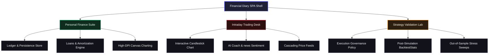

# 📊 Financial Diary — Personal Finance Suite & Institutional Algorithmic Workstation

[]()
[]()
[]()
[]()

Financial Diary is an institutional-grade, high-performance web workstation that combines a premium personal finance suite with a state-of-the-art **Intraday Trading Desk & Strategy Validation Lab**. Engineered with a glassmorphic modern UI and high-fidelity vanilla JavaScript engines, the application implements real-time market data retrieval, advanced canvas charts, AI confluences, paper trading, and a complete suite of professional backtesting and risk management algorithms.

---

## 🏛️ System Architecture Overview

The system is architected as a Single Page Application (SPA) structured around a unified local database and isolated computation engines.



---

## 🔬 Institutional Algorithmic Trading Pipeline

The Strategy Validation Lab operates on a highly realistic, lookahead-protected processing pipeline designed to match professional trading workstations.

```mermaid
flowchart TD
    %% Node definitions
    subgraph Data Ingestion
        D1["Irregular Price Ticks (Yahoo Finance API)"] --> D2["VWAP Resampling (Fixed 1s/5s/1m Bars)"]
        D2 --> D3["Rolling Z-Score Normalizer (Prev 20 Days)"]
        D3 --> D4["Irwin-Hall Synthetic Offline Fallback"]
    end

    subgraph Feature Engineering (Microstructure Engine)
        F1["Order Flow Imbalance (OFI)"] & F2["Amihud Illiquidity Ratio"] & F3["Roll Model Spread Estimation"] & F4["Kyle's Lambda (Price Impact)"] & F5["Hasbrouck Information Share"] & F6["Garman-Klass Volatility"]
    end

    subgraph Signal Generation (Model Ensemble)
        S1["Model A: Temporal Fusion Transformer (TFT)"]
        S2["Model B: Deep Limit Order Book (DLOB)"]
        S3["Model C: Hidden Markov Model (HMM)"]
        S4["Model D: Reinforcement Learning (RL) Execution"]
        
        S1 & S2 & S3 & S4 --> S5["XGBoost-Style Meta-Learner Signal Combiner"]
    end

    subgraph Risk Management & Sizing
        R1["Fractional Kelly Position Sizing"]
        R2["Risk-Parity Volatility Scaling"]
        R3["99% Conditional Value at Risk (CVaR)"]
        R4["Correlation-Adjusted Exposure"]
        R5["Macro Event Proximity Filter"]
        R6["2% Daily Drawdown Circuit Breaker"]
        
        R1 & R2 & R3 & R4 & R5 & R6 --> R7["Almgren-Chriss Optimal Trajectory"]
    end

    subgraph Smart Execution Routing
        E1["Smart Order Router (SOR)"]
        E1 --> E2["TWAP / VWAP Slices"]
        E1 --> E3["Iceberg Hidden Orders"]
        E1 --> E4["Dark Pool Pegged Fills"]
    end

    subgraph Validation & Auditing
        A1["Walk-Forward Expanding Window Validation"]
        A2["Monte Carlo Returns Permutation Test"]
        A3["Deflated Sharpe Ratio (Multiple Testing Penalty)"]
        A4["Indian Market Transaction Cost Model"]
        A5["Queue-Based Partial Fill Modeling"]
    end

    %% Flow connections
    Data Ingestion --> Feature Engineering
    Feature Engineering --> Signal Generation
    Signal Generation --> Risk Management & Sizing
    Risk Management & Sizing --> Smart Execution Routing
    Smart Execution Routing --> Validation & Auditing

    %% Styling
    style Data Ingestion fill:#09090b,stroke:#2a2a3e,stroke-width:1px
    style Feature Engineering fill:#09090b,stroke:#2a2a3e,stroke-width:1px
    style Signal Generation fill:#09090b,stroke:#2a2a3e,stroke-width:1px
    style Risk Management fill:#09090b,stroke:#2a2a3e,stroke-width:1px
    style Smart Execution Routing fill:#09090b,stroke:#2a2a3e,stroke-width:1px
    style Validation fill:#09090b,stroke:#2a2a3e,stroke-width:1px
```

---

## 📘 Subsystem Specifications & Quantitative Models

### 1. Microstructure Feature Engineering (`js/microstructure.js`)
Exposes `window.MicrostructureEngine`, providing high-fidelity spatial and liquidity metrics extracted from bar-level and reconstructed order book data.
*   **Order Flow Imbalance (OFI):** Measures instantaneous supply-demand discrepancies at BBO:
    $$\text{OFI}_{\text{bar}} = \frac{\Delta\text{BidVol} - \Delta\text{AskVol}}{\text{TotalVol}}$$
*   **Trade Imbalance:** Skew of buyer-initiated vs. seller-initiated trades based on typical price geometry:
    $$\text{Trade Imbalance} = \frac{\text{Buyers} - \text{Sellers}}{\text{TotalTrades}}$$
*   **Amihud Illiquidity Ratio:** Captures price impact per unit of transacted volume:
    $$\text{Amihud} = \frac{|r_t|}{\text{Volume}_t}$$
*   **Roll Bid-Ask Spread Estimator:** Estimates effective spreads using log returns' first-order autocovariance:
    $$\text{Spread}_{\text{Roll}} = 2 \times \sqrt{-\text{Cov}(r_t, r_{t-1})}$$
*   **Kyle's Lambda ($\lambda$):** Measures continuous price impact coefficient estimated via OLS:
    $$\Delta\text{Price}_t = \alpha + \lambda \times \text{SignedVolume}_t + \epsilon_t$$
*   **Garman-Klass Volatility:** Extreme-value variance estimator utilizing Open, High, Low, and Close data:
    $$\sigma^2_{\text{GK}} = 0.5 \times \left(\ln\frac{H_t}{L_t}\right)^2 - (2\ln2 - 1) \times \left(\ln\frac{C_t}{O_t}\right)^2$$

### 2. Signal Generation Ensemble (`js/signalModels.js`)
Exposes `window.SignalModels`, deploying an ensemble of ML architectures gated dynamically by market regimes:
*   **Model A — Temporal Fusion Transformer (TFT):** Simulates multi-horizon forecasts by combining historical sequences and static sector metadata. Employs a self-attention mechanism to output a **quantile distribution** of log returns ($P_{10}$, $P_{50}$, $P_{90}$) instead of a single point estimate.
*   **Model B — Deep Limit Order Book (DLOB):** Generates synthetic 10-level bid/ask order book snapshots using geometric decay. Computes pressure gradients and monitors **order absorption** (concentration drops while volume imbalance persists). Calibrates directional probabilities using **Platt Scaling**:
    $$P_{\text{calibrated}} = \frac{1}{1 + e^{-(A \cdot S_{\text{raw}} + B)}}$$
*   **Model C — Hidden Markov Model (HMM):** Classifies the market into four regimes (*Trending Up*, *Trending Down*, *Mean-Reverting*, and *High-Vol Choppy*) by evaluating realized volatility, autocorrelation, and spreads using the **Forward Algorithm** scaled in log-space.
*   **Model D — Reinforcement Learning (RL) Execution Agent:** Decides execution actions (Buy, Sell, Hold, Close) shaped in simulation by an **Almgren-Chriss optimal execution baseline reward** to teach the agent to minimize market impact from day one.
*   **XGBoost-Style Meta-Combiner:** Combines the individual model predictions and current HMM state probabilities using a multi-variate non-linear attribution to produce a unified signal score in $[-1, 1]$.

### 3. Risk Management & Execution Routing (`js/riskEngine.js`)
Exposes `window.RiskEngine`, operating as the mandatory pre-trade and real-time capital protection gate:
*   **Fractional Kelly Criterion:** Sizes allocations based on win probabilities ($p$) and average win-to-loss ratios ($b$), capped at a maximum of 2% of liquid capital at risk:
    $$f^* = \text{Multiplier} \times \frac{p \cdot b - (1 - p)}{b}$$
*   **Conditional Value at Risk (CVaR):** Computes Expected Shortfall ($ES_{99\%}$) to protect against severe tail risk.
*   **Drawdown Circuit Breaker:** Instantly halts new entries and restricts operations to position closures if intraday equity drawdown exceeds $1.5 \times$ the historical Average Daily Range (ADR).
*   **Correlation-Adjusted Exposure:** Measures sector and asset concentration risks using pairwise return correlations:
    $$\text{Effective Exposure} = \sum \frac{|V_i| \cdot (1 + \bar{\rho}_{ij})}{2}$$
*   **Smart Order Router (SOR):** Simulates TWAP, VWAP, and Iceberg orders. Models execution slippage via the square-root market impact model:
    $$\text{Impact} = \sigma \times \sqrt{\frac{Q}{\text{ADV}}} \times \text{Urgency}$$
*   **Almgren-Chriss Optimal Execution:** Plots the mathematically optimal trade trajectory to unload a position block over $T$ periods, balancing market impact costs against the risk of adverse price moves.

### 4. Backtesting & Statistical Auditing (`js/backtestStats.js`)
Exposes `window.BacktestStats`, guaranteeing institutional validation standards:
*   **Walk-Forward Optimization:** Validates out-of-sample persistence using expanding training sets and fixed-length test sets. Measures parameter **degradation ratios** (OOS Sharpe / IS Sharpe).
*   **Monte Carlo Permutation Test:** Shuffles return series 500 times using a seeded Mulberry32 random generator to calculate strategy significance ($p < 0.05$).
*   **Deflated Sharpe Ratio (DSR):** Penalizes observed Sharpe ratios for data-mining bias, adjusting for return skewness, excess kurtosis, and the total number of strategy variations tested ($N$):
    $$\text{DSR} = \Phi\left( \frac{\text{SR}_{\text{obs}} - \text{E}[\max(\text{SR}_i)]}{\sigma(\text{SR}_{\text{obs}})} \right)$$
*   **Indian Market Transaction Cost Model:** Models precise friction fees: STT (0.025% intraday), GST (18% on brokerage), SEBI turnover fees, stamp duty, and a ₹20/order brokerage cap.

---

## 📦 Codebase Component Map

The core framework is divided modularly into isolated ES5-IIFE subsystems to ensure high execution performance and browser compatibility:

| Subsystem | File Path | Scope & Responsibility |
| :--- | :--- | :--- |
| **Data Store** | [`js/store.js`](file:///C:/Users/majee/.gemini/antigravity/scratch/finance-manager/js/store.js) | LocalStorage database, compound recurring processes, currency formatters. |
| **Canvas Charts** | [`js/charts.js`](file:///C:/Users/majee/.gemini/antigravity/scratch/finance-manager/js/charts.js) | Sharp scaled Hi-DPI candlestick, Bezier line, doughnut, and progress charts. |
| **Liabilities Desk** | [`js/emis.js`](file:///C:/Users/majee/.gemini/antigravity/scratch/finance-manager/js/emis.js) | Loan profiles, compound EMI schedules, liability alert banners, and payoff channels. |
| **Trading Desk** | [`js/trading.js`](file:///C:/Users/majee/.gemini/antigravity/scratch/finance-manager/js/trading.js) | Interactive candlesticks, custom overlays (Bollinger, SMA, Heikin Ashi), AI coach. |
| **Microstructure** | [`js/microstructure.js`](file:///C:/Users/majee/.gemini/antigravity/scratch/finance-manager/js/microstructure.js) | OFI, trade imbalances, Kyle's Lambda, Hasbrouck Information Share, Garman-Klass vol. |
| **Signal Engine** | [`js/signalModels.js`](file:///C:/Users/majee/.gemini/antigravity/scratch/finance-manager/js/signalModels.js) | TFT multi-horizon quantiles, DLOB book snapshots, HMM regimes, RL PP/SAC executes. |
| **Risk Gate** | [`js/riskEngine.js`](file:///C:/Users/majee/.gemini/antigravity/scratch/finance-manager/js/riskEngine.js) | Kelly sizing, CVaR 99%, Almgren-Chriss trajectories, drawdown breakers, SOR. |
| **Backtest Stats** | [`js/backtestStats.js`](file:///C:/Users/majee/.gemini/antigravity/scratch/finance-manager/js/backtestStats.js) | Walk-forward folds, Monte Carlo permutations, Deflated Sharpe, transaction costs. |
| **Simulator Core** | [`js/portfolioSimulator.js`](file:///C:/Users/majee/.gemini/antigravity/scratch/finance-manager/js/portfolioSimulator.js) | Execution policies, circuit breakers, state transitions, advanced stats compiler. |
| **Audit Desk** | [`js/audit.js`](file:///C:/Users/majee/.gemini/antigravity/scratch/finance-manager/js/audit.js) | Institutional UI validation desk, calendar checks, robustness stress badges. |
| **Export/Report** | [`js/auditReport.js`](file:///C:/Users/majee/.gemini/antigravity/scratch/finance-manager/js/auditReport.js) | Formats and outputs download-ready CSV ledgers and JSON performance packs. |
| **App Shell** | [`js/app.js`](file:///C:/Users/majee/.gemini/antigravity/scratch/finance-manager/js/app.js) | SPA router, central views navigator, global modal backdrops, and toasts. |

---

## 🛠️ Installation & Local Setup

### Prerequisites
*   [Node.js](https://nodejs.org/) (v16.0.0 or higher recommended)

### 1. Clone & Navigate
```bash
git clone https://github.com/CodeWhizAfsal/am-chat.git
cd am-chat
```

### 2. Launch Local Server
The application is a pure front-end static application. Launch a lightweight, zero-caching static file server:
```bash
# Install and run local static server
npx -y http-server -p 8080 -c-1
```
The workstation will open instantly at `http://localhost:8080`.

### 3. Public Exposure (Localtunnel)
To test responsive and touch-chart features on external mobile devices:
```bash
npx -y localtunnel --port 8080
```

---

## 🔬 Strategy Validation Lab Workflow

To perform an institutional-grade audit on a trading setup:
1.  Navigate to the **Validation Lab** view via the sidebar tools navigation.
2.  Set your baseline parameters: Simulation Date (e.g. `2026-05-15`), Starting Capital (e.g. `₹5,00,000`), and Risk Limit.
3.  Click **Start Institutional Validation Replay**.
4.  The system will initiate the state machine, tracking lookahead-protected price ticks:
    $$\text{WAIT} \longrightarrow \text{SCAN} \longrightarrow \text{QUALIFY} \longrightarrow \text{ENTER} \longrightarrow \text{MANAGE} \longrightarrow \text{COOLDOWN} \longrightarrow \text{EXIT}$$
5.  Following the primary backtest, the simulator triggers the **Out-of-Sample Stress Sweep**, testing the strategy across two distinct historical regimes (Bearish Drift and High Volatility Choppiness).
6.  The dashboard will render the finalized statistics (Sharpe, CVaR, DSR, and Monte Carlo $p$-value) alongside a **Model Governance Certification Badge** (`ROBUSTNESS PASSED` or `ROBUSTNESS REJECTED`).
7.  Download the results instantly via **Export CSV Ledger** or **Export JSON Report**.

---

## 📜 License
This project is licensed under the MIT License. Created as an advanced quantitative research workstation.
